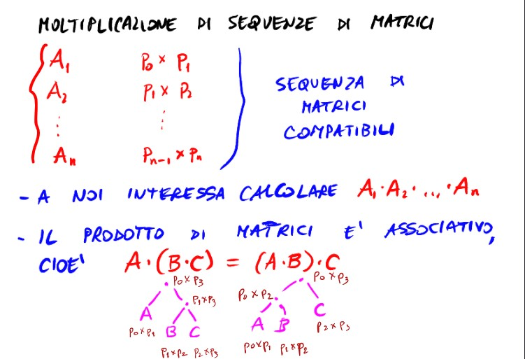
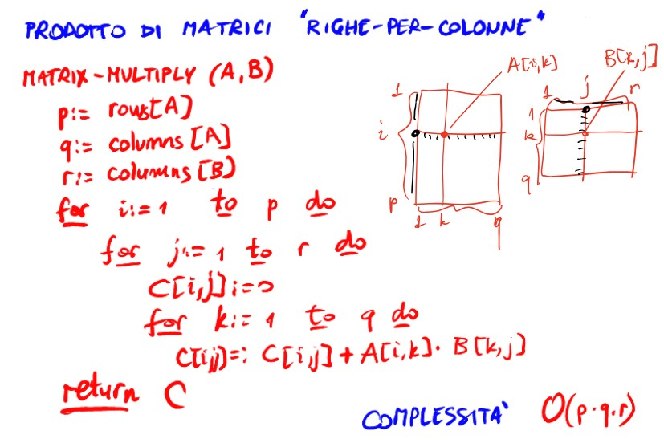
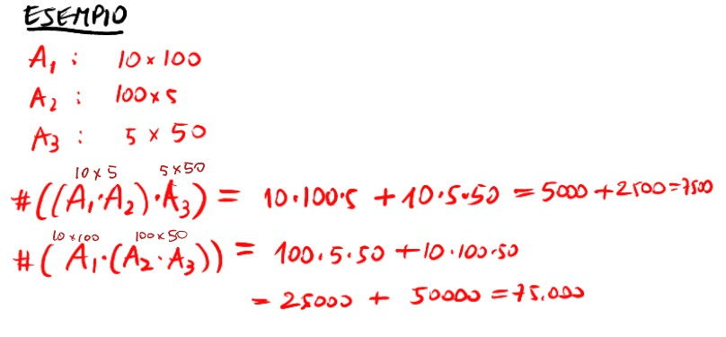
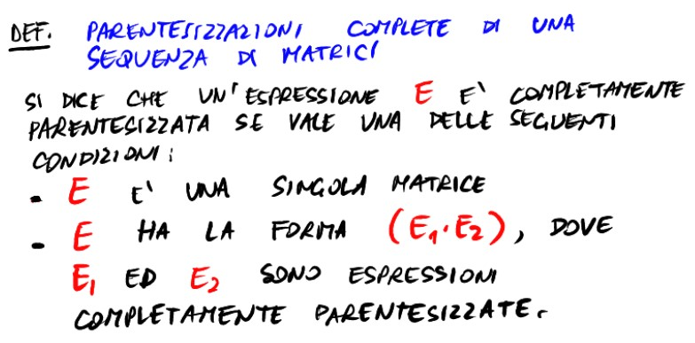
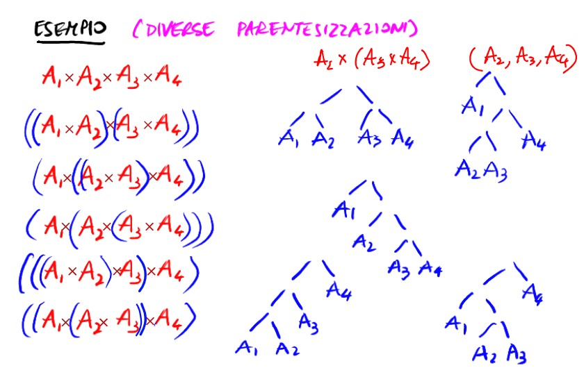
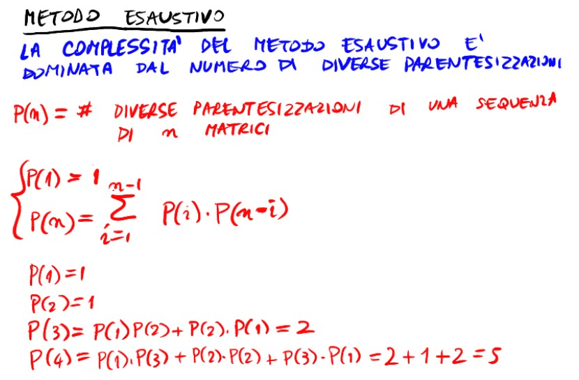
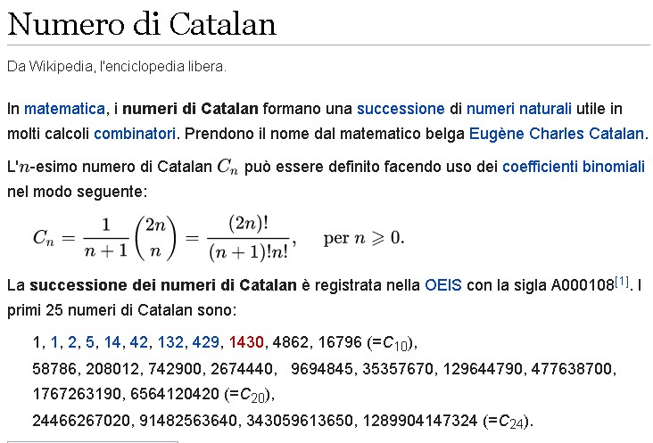
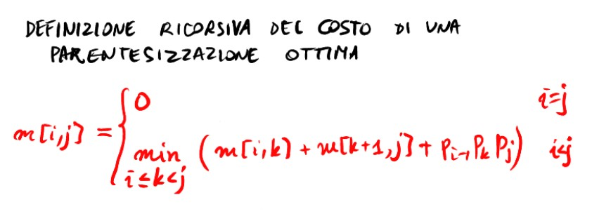

# **Alg - 1** 

## **Programmazione dinamica** 

* Problemi di ottimizzazione: ognuno con un valore, si cerca quella di valore max o min (massimizzi guadagno o minimizzi il costo)

* Moltiplicazione per matrici p × q, q × r

* Indice i,j  di A × B = Sommatoria[k = 1][q](A[i,k] × B[k, j]);
  * q moltiplicazioni scalare per ottenere il valore agli indici (i, j)
  * per moltiplicare le due matrici si fanno p × q × r moltiplicazioni 
    * Infatti la complessità è un triplo ciclo for annidato
  
* Moltiplicazione di sequenza di matrici 


* Somma di moltiplicazioni

* Possiamo fare questa cosa solo se sono matrici quadrate (?)

* Prodotto di tre matrici compatibili
    * Il prodotto tra matrici è ASSOCIATIVO (non commutativo)



***

* Moltiplicare ((A1 × A2) × A3) potrebbe non dare lo stesso numero di prodotti scalari rispetto a ((A1)×(A2 × A3))



* Il tempo per effettuare le moltiplicazioni dipende dal numero di moltiplicazioni scalare
* Bisogna determinare la **parentesizzazione ottima** (quella che corrisponde col minor numero di prodotti scalari)

* Nel caso dell'esempio, ((A1 × A2) × A3) è dieci volte meglio dell'altra

### **Parentesizzazioni complete di sequenze di matrici**



* Consideriamo sempre una coppia di parentesi esterne all'espressione
* Le diverse parentesizzazioni hanno forma di albero (???)
* Con tre matrici ci sono 2 modi di parentesizzare
* Con 4 matrici sono 5


* Un modo di trovare la migliore parentesizzazione completa potrebbe essere usando Brute Force/Esaustivo (generare tutte le parentesizzazioni e calcolare i prodotti scalari di ognuna) (ma ci vuole UN CASINO DI TEMPO quindi no)(cresce ESPONENZIALMENTE)
  


* P(n) = Numero di diverse parentesizzazioni di  una sequenza di n matrici
  * Numeri di Catalan (detti anche numeri catalani)
  * (P(n) = quante parentesizzazioni sono possibili con n Matrici)
  * [link wiki](https://it.wikipedia.org/wiki/Numero_di_Catalan)
    

* P(n) >= 2 × P(n-1) 
  * Ovvero più che raddoppia ad ogni n
  * Continuo a scalare P(n-1) e ad aumentare l'esponente di 2 finché non arrivo a 2^(n-2) × P(2) = 2^(n-2)

* Quindi è una complessità ALMENO esponenziale, Omega(2^(n))

*** 

### **Caratterizzazione di una soluzione ottima**

* Ipotizzando che E **sia** una parentesizzazione ottima, e E = ( E1 × E2 ), allora anche E1 e E2 sono necessariamente sottoproblemi/sottoparentesizzazioni ottime
* 
* Ciascuna delle componenti del problema della soluzione ottima deve essere a sua volta una parentesizzazione ottima

        numProdScal(E) = numProdScal(E1) + numProdScal(E2) + (p0 × pk × pn)

(p0 × pk × pn sono le dimensioni delle matrici, da A1 a Ak e da Ak-1 a An)

* Una parentesizzazione ottima di E = (E1 × E2) contiene anche le parentesizzazioni **ottime** di E1 e di E2 
  * **Proprietà della sottostruttura ottima**

* Abbiamo necessità di dover risolvere una sottosequenza di una sequenza che sappiamo risolvere (Se abbiamo intervallo A1 - Ak, dobbiamo poter risolvere A1 - Ai, Ai+1 - Ak)
* In generale = Sequenze A(i, j);

        Lo spazio delle soluzioni: 
            {(A[i], ..., A[j]) : 1 <= i <= j <= n } 

***


* **definizione ricorsiva del costo di una parentesizzazione ottima**
  * (ovvero del numero dei prodotti scalari)



* tutti i valori in cui i > j non vengono contati -> siamo interessati ai valori dove i <= j

* Caso base quando i = j
  * NON facciamo moltiplicazioni scalari; m[i,j] = 0

* La sequenza ottima di A[i] × A[j] la otteniamo:
<br><br>
  * prima spezzando A[i] × (A[i+1] × ... × A[j])  
    * m[i, i] + m[i+1, j] + (p[i-1] × p[i] × p[j])
<br><br>
  * poi provando (A[i] × A[i+1]) × (A[i+2] × ... × A[j])
    * m[i, i+1] + m[i+2, j] + (p[i-1] × p[i+1] × p[j])
<br><br>
  * etc
    * m[i, j-1] + m[j, j] + (p[i-1], p[j-1], p[j])
* Ma questi sono sottoproblemi che abbiamo già risolto (??)

QUINDI

* passo induttivo 
  * min[con i <= k <= j] di (m[i, k] + m[k+1, j] + (p[i-1], p[k], p[j]))
  * con i < j

* Per calcolare m[i,j] è necessario avere
  * m[i, i], m[i+1, j]
  * m[i, i+1], m[i+2, j]
  * m[i, i+2], m[i+3, j]
  *  .  .. . . . .. . .
  * m[i, j-1], m[j, j]

        {  min[con i <= k <= j] di (m[i, k] + m[k+1, j] + (p[i-1], p[k], p[j]))

***

```
MATRIX_CHAIN_ORDER(p){
  for i:= 1 to n do
      m[i, i] := 0
  for Δ := 1 to n-1 do
      for i := 1 to n-Δ do
          j := Δ + i
          m[i, j] := +∞
          for k:= i to j-1 do
              q := m[i, k] + m[k+1, j] + (p[i-1] * p[k] * p[j])
              if(q < m[i,j]) then
                    m[i, j] := q
                    s[i, j] := r (????) //s --> matrice che contiene il valore (per il quale bisogna fermarsi??)
  return m, s 
}
```
* L'algoritmo è Theta(n^(3))
* CONTROLLARE LE SLIDES NUOVE CON I CALCOLI 