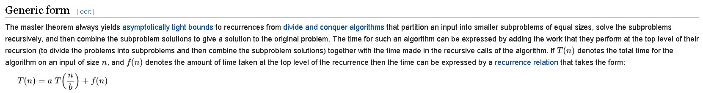
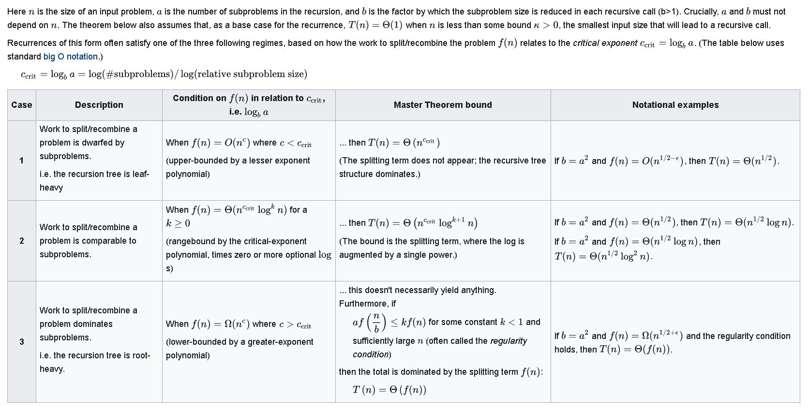
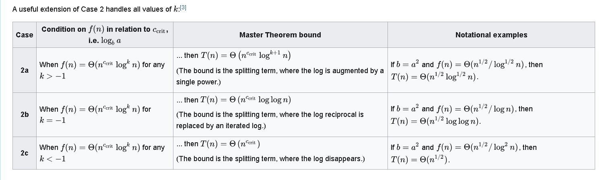
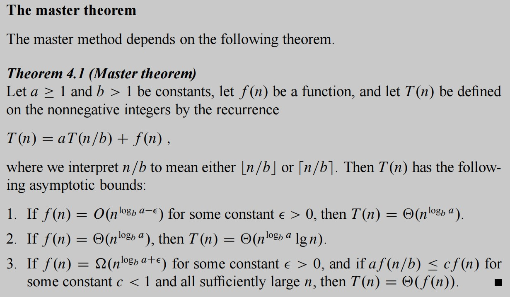

# **ALG**

    --> rivedere le ricorrenze parametriche, dove "a" o "b" o "f(n)" non sono termini noti

    possibile domanda di esame = definire notazioni asintotiche su ricorrenze date

***

***

esercizio di compito di esame

1. Si enunci il teorema master e il suo corollario  

2. **Si definiscano le notazioni asintotiche o(f(n)), omegapiccolo(f(n)), Theta(f(n)), per una data funzione f:Nat --> Nat.**

        opiccolo di f(n) è diverso da opiccolo(g(n)). Se chiede f(n) --> non trasformarlo in g(n). --> libertà sul nome della funzione interna.

        opiccolo(f(n)) = { h(n) : qualunque c > 0  ESISTE n0 appartenente a Nat, per ogni n >= n0,  0 <= f(n) < c * h(n)}

        omegapiccolo(f(n)) = {  }

        METTERE LE PARENTESI TRA LE CONDIZIONI!!

3. Si risolva l'equazione di ricorrenza T(n) = a * T(n/4) + Theta(n^2 log^2 n) al variare del parametro reale a > 0

        lg[b](a) <--> a <=> 16??

                { Theta(n^(lg4(a))) SE a > 16
            T(n) = { Theta(n^2 lg^(3) n) SE a = 16
                { Theta(n^2 lg^2 n) SE 0 < a < 16
        
**----> controllare i vari casi di "a" quando "a" è parametrico (anche con i grafici, per capire dove si posizionano le funzioni)**